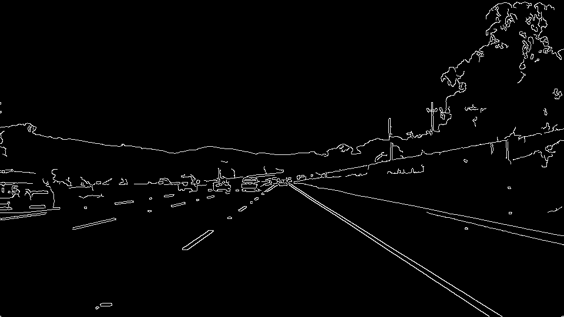
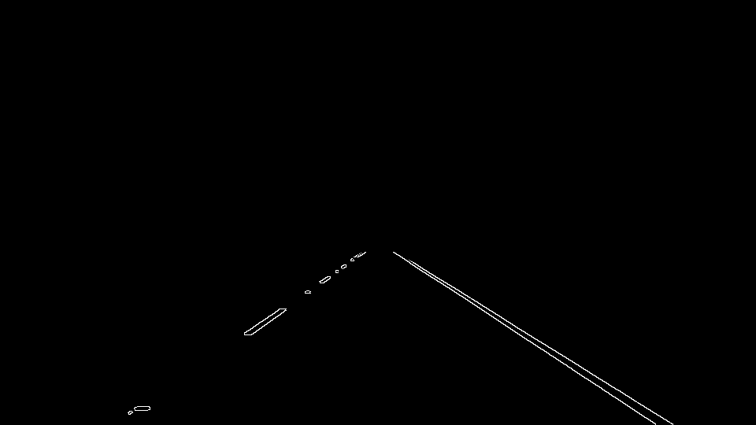
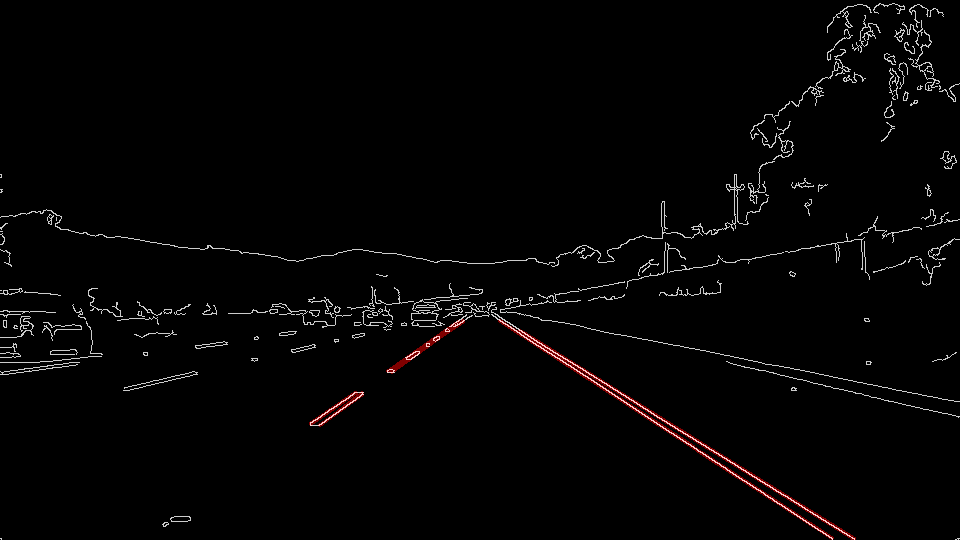
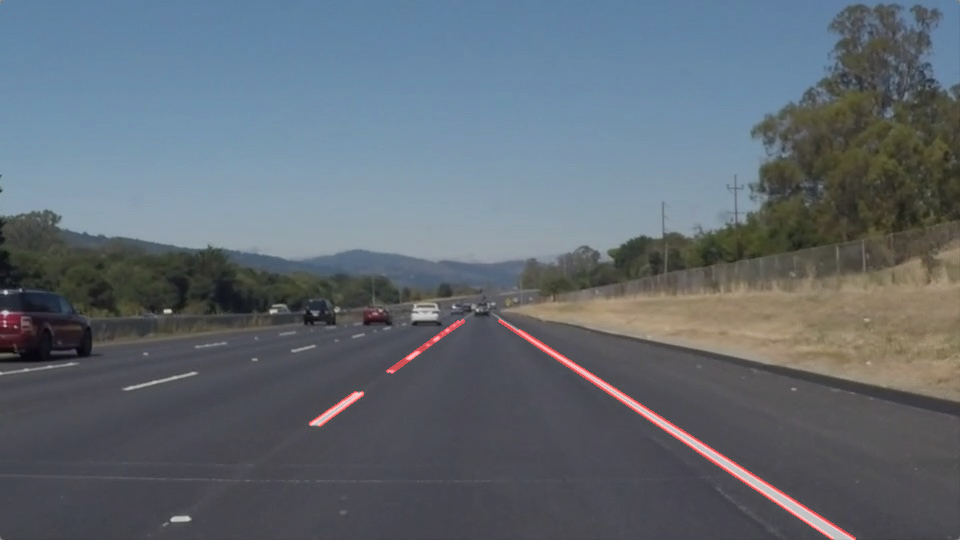

#Project Write-up: Finding Lane Lines

##Student: Jack Olivieri

##Date: 03.19.2017

### Reflection

I started by defining a set a parameters that is common to the entire notebook. These outline the characteristics of the region of interest, gaussian and canny filter, and Hough transform. All of them have been carefully tweaked by observing their effects and by leveraging the learned concepts. The pipeline has been then tested by performing the following steps on all images in the *test_images* directory:

- loading the image file

 
<figure>
 
</figure>
 

 

- converting the image to grayscale

 
<figure>
 
</figure>
 

 
- applying the gaussian filter to smooth out imperfections and the canny filter to detect gradient changes (edges)

 
<figure>
 
</figure>
 

- applyng the region-of-interest by masking the pixels (the vertices have been tweaked visually)

 
<figure>
 
</figure>
 

 
- applying the hough transform on the masked region (and superimposing the lines on the canny-filtered image, for reference)

 
<figure>
 
</figure>
 

 
- showing the lines superimposed on the original image

 
<figure>
 
</figure>
 

### Notes on the improved draw_lines function
The improved *draw_lines* function implements a simple algorithm to draw a solid line by extrapolating and averaging lines out of the Hough-transform-returned segments.
In order to achieve this, it iterates over each frame and performs the following on each line returned by the Hough transform:

- given two sets of point coordinates *(x1, y1)* and *(x2, y2)*, it performs a simple linear regression to extrapolate slope and offset of a line of the form *y = slope\*x + offset*
- verifies whether the slope is big enough in order to filter out horizontal lines and noisy results produced by the Hough transform
- inserts the slope and offset values into either a *left_lane-list* or a *right_lane-list* depending on the slope sign
- averages values over these two lists to find the slope and offset average for both lanes in the current frame
- derives two sets of points coordinates given the average slope and offset (the first has a fixed x-value when crossing the bottom of the picture, the second has a fixed y-value when reaching the end of the solid line)
- to render the function more robust, NaN values are carefully converted to invalid integer values to signal skipping the drawing of the line
- the solid lines are finally drawn

### Potential shortcomings

The improved *draw_lines* function will not detect horizonal lines, which is a common use-case when driving, especially when steering rapidly or running through a street junction.
Furthermore, the region of interest and the pipeline parameters have been tuned to work best in the ideal condition where no car is occupying or switching to and from the current lane within close range.
Also, the pictures in the *test_images* directory depict almost perfectly straight lane lines, which are nicely detected when the Hough-transform-grid features finely-spaced *theta* values. This would not be the case for turns as the lane lines would display a significant curvature.

### Possible improvements

Allowing the *draw_lines* function to detect horizontal lines would be possible if, instead of discarding the slopes below a certain threshold, statistics of the slope values were collected over a certain amount of frames. Only those values that significantly deviate from the average values, in amounts proportional to the standard deviation, would be neglected. This way horizontal lines would be discarded only if they were occasionally presenting themselves, for instance in form of noise, whereas a consistent horizontal line would keep confirming its presence throughout various frames.
Another improvement would be tuning the *theta* Hough parameter so as to allow segments of different slant to be part of the same line. This would result in curved lines to be correctly detected. Although, since when driving on a straight road would not require a large *theta* values, it would be even more ideal to have parameters that automatically adapt to different pre-tuned use-cases such as having straight or curved lane lines.