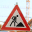
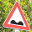
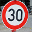

#**Project 2: Traffic Sign Recognition** 

---

##**Build a Traffic Sign Recognition Project**

The goals / steps of this project are the following:

* Load the data set (see below for links to the project data set)
* Explore, summarize and visualize the data set
* Design, train and test a model architecture
* Use the model to make predictions on new images
* Analyze the softmax probabilities of the new images
* Summarize the results with a written report

[//]: # (Image References)

[image1]: ./data_distribution.png "Data distribution"
[image2]: ./most_frequent_sign.png "Most frequent sign"
[image3]: ./most_frequent_gray.png "Most frequent sign - converted to grayscale"
[image4]: ./loss_plot.png "Loss plot"

###I will consider the [rubric points](https://review.udacity.com/#!/rubrics/481/view) and address them
###Link to my project: [project GitHub repo](https://github.com/boldorider4/udacity_self_driving_engineer/tree/master/P02-TrafficSign/Traffic_Sign_Classifier.ipynb)

---
###Data Set Summary & Exploration

####1. Basic summary of the data set.

I used the numpy library to calculate summary statistics of the traffic signs data set:

* The size of training set is 34799
* The size of the validation set is 12630
* The size of test set is 4410
* The shape of a traffic sign image is (32, 32, 3) = (32x32, 3 color depth)
* The number of unique classes/labels in the data set is 43

####2. Exploratory visualization of the dataset.

Here is an exploratory visualization of the data set. It is a bar chart showing how the data is distributed across the various types of traffic signs.

![alt text][image1]

One can immediately notice that the distribution is not uniform across the different sign classes. Some sign classes, such as the 'Dangerous curve to the left', have very little occurrence. This will result in the network being better trained on the most occurring sign types and less trained on those occurring less frequently, by extention rendering the model accordingly inclined to recognize these.
Here follows an example of the sign mostly occurring: the 50 km/h speed limit.

![alt text][image2]

###Design and Test a Model Architecture

####1. Image preprocessing

The preprocessing consists of two steps:

1. converting to grascale: this steps was introduced after experimenting with the network model and assessing that the color information did not yield any signigicant advantage in the classification accuracy. Converting to grascale does furthermore reduce the number of weights of the first convolution, since the filter only has one channel input to process, as opposed to three.

2. normalizing the image values: the normalization is a fundamental step that guarantees that values are well-conditioned in order to allow the model to converge to a loss minima avoiding instability. The input values normally range [0, 255] and they are normalized to the range [-0.5, 0.5[, then further scaled by 0.95.

![alt text][image3]

In order to enhance the model weights and biases, one could have augmented the data set by appending the new images to training set, or simply by taking a subset of the existing set and slightly modifying its pictures and then appending these to the original training set. Simple modifications could have involved, for instance, shifting of the image pixels (paying attention not to crop pixels belonging to the sign) or mirroring those signs that don't change in fundamental shapes and features when mirrorred (for example, the 'Right-of-way at the next intersection' sign).

The reason why I did not bother augmenting the data-set, despite understanding the implications of such a technique, is that by slightly bettering the model architecture (see below) I could already achieve a test accuracy greater than 93%, considered adequate as per the project rubric.

####2. Model architecture

The deep neural network architecture consists of the following layers:

| Layer         		|     Description	        					| 
|:---------------------:|:---------------------------------------------:| 
| Input         		| 32x32x1 Grayscale image							| 
| Convolution 3x3     	| 1x1 stride, valid padding, outputs 30x30x32 	|
| Activation					|	Relu								|
| Max pooling	      	| 2x2 stride,  outputs 15x15x32 				| 
| Convolution 2x2     	| 1x1 stride, valid padding, outputs 14x14x24 	|
| Activation					|	Relu								|
| Max pooling	      	| 2x2 stride,  outputs 7x7x24				| 
| Convolution 2x2     	| 1x1 stride, valid padding, outputs 6x6x16 	|
| Activation					|	Relu								|
| Dropout					| keep probability = 60% (training), 100% (validation and test)							|												|
| Flatten					| Outputs 576 (1-D array size)	                 	|
| Fully connected		| Outputs 120 (1-D array size)        									|
| Activation					|	Relu								|
| Fully connected		| Outputs 84 (1-D array size)        									|
| Activation					|	Relu								|
| Dropout					| keep probability = 60% (training), 100% (validation and test)							|												|
| Fully connected		| Outputs n_classes (1-D array size) = 43        									|
 
The architecture derived from the LeNet model presented in the [Convolutional Neural Network class] (https://classroom.udacity.com/nanodegrees/nd013/parts/fbf77062-5703-404e-b60c-95b78b2f3f9e/modules/6df7ae49-c61c-4bb2-a23e-6527e69209ec/lessons/601ae704-1035-4287-8b11-e2c2716217ad/concepts/d4aca031-508f-4e0b-b493-e7b706120f81). After an initial training and testing round with the LeNet network, the model showed over-fitting in as few as 10-15 epochs while failing to reach 93% validation accuracy: such overfitting was evident as soon as the validation loss started increasing whilst the training loss was decreasing, with such a behavior being captured and plotted for better visibility.

To address the overfitting, the network has then been expanded to include an additional convolutional layer, in an effort to enable the network to pick up more features from the images. The convolution layer filter have been resized accordingly, the padding has been kept 'valid' and the final convolution has been followed by a dropout layer instead of a max pooling layer, in order to obtain a sensible 6x6x16 output before flattening it and inputting it into the fully connected layers. The choice behind adopting a dropout layer was also based on leaving more room for the model to fit the training set without over-fitting too quickly.

####3. Model modification approach and training

The adoption of a certain network architecture and parameters has been partially based on trial-and-error, with some of the considerations above mentioned taken into account. An initial architecture was already provided and the initial values for the training parameters could be easily infered by the lessons' exercises. After deciding to act on the model structure and parameters rather than augmenting the training data set, changes to the model and parameters were attempted and compared based on the achieved validation accuracy.

The approach followed an iteration of steps which stops when an acceptable validation accuracy is achieved:

1. increasing the learning rate and stopping before making the training unstable
2. increasing the number of epochs before starting to over-fit
4. adding an additional convolutional and activation layer after the last convolutional layer, resizing all filters accordingly
5. incrementing the intra-layer channel number to increment the degrees of freedom of the model
6. adding a new dropout layer after the convolutional layer to further stress the network
7. repeat from step 1. until an acceptable validation accuracy is reached

The idea behind adding a convolutional layer is to split the analysis of the features of the image into multiple steps. For example: the first layer could be sensing the outer shape of the traffic sign, the middle layer could be sensing an inner shape and the third layer could pick up some small details of such an inner shape.
When an acceptable accuracy was reach, it was noticeable that both training and validation losses (shown below) tended to decrease at each epoch without intersecting each other. This tendency suggests that there is still some room for the losses to decrease further, but the number of epochs has been capped in order for the training session not to take too long refining the loss at insignificant steps.

####4. Model results

![alt text][image4]

* Training set accuracy: 94.6%
* Validation set accuracy: 94.4% 
* Test set accuracy: 94.4%

As mentioned above, plotting the training and validation losses allows to asses whether an increasing training accuracy at the expense of a decreasing validation accuracy is signaling over-fitting. In this case the trends of the two losses are somewhat parallel, proving that at each epoch not only does the training accuracy increase, but also the validation accuracy. By testing the model on the test data set, it is noticeable that the accuracy is very well comparable with the validation accuracy, proving that the model is working properly.
 

###Test Model on new images

####1. Considerations on the images

The classifier is challenged on the 'roadwork' sign since it is one of the triangule-shaped signs enclosing the depiction of hazardous situations, rich of significant details. These can be easily confused with equally detailed road signs and will put to the test the later convolutional layers. Another challenging sign is the bumpy road since the training set is scarcely populated by it and is therefore harder for the network to recognize.

####2. Classification results

The results of the prediction are the following:

| Image			        |     Prediction	        					| 
|:---------------------:|:---------------------------------------------:| 
| Road work      		| Road work (25)   									| 
| No entry     			| No entry (17) 										|
| Bumpy road					| Bumpy road (22)											|
| Right of way km/h	      		| Right of way (11)					 				|
| 30 km/h speed limit			| 30 km/h speed limit (1)     							|

The model was able to correctly classify all of the signs, yielding an accuracy of 100%. This compares favorably to the accuracy on all of the sets, which was around 94%. The fact that most of the images chosen were significantly present in the data set further suggests that the model will predict them with more certainty and that will tend to classify them correctly.

####3. Top 5 Softmax probabilities

For each image, the top 5 Softmax probabilities are analysed.

.1. Road work

| Probability         	|     Prediction	        					| 
|:---------------------:|:---------------------------------------------:| 
| 9.99813497e-01         			| Road work  									| 
| 1.79983574e-04     				| Dangerous curve to the right										|
| 5.54007829e-06					| Beware of ice/snow											|
| 7.32907040e-07	      			| Turn left ahead				 				|
| 1.84219502e-07			    | Keep right   							|

.2. No Entry

| Probability         	|     Prediction	        					| 
|:---------------------:|:---------------------------------------------:| 
| 9.999999999e-01         			| No Entry  									| 
| 2.61869415e-10     				| Keep right										|
| 5.18819224e-11				| Turn left ahead										|
| 3.90472932e-11      			| End of all speed limits				 				|
| 1.84951533e-11			    | Stop    							|

.3. Bumpy road

| Probability         	|     Prediction	        					| 
|:---------------------:|:---------------------------------------------:| 
| 9.99767005e-01        			| Bumpy road  									| 
| 1.69729712e-04   				| Turn left ahead										|
|  4.90327729e-05			| Stop											|
| 7.76184879e-06      			| Bicycles crossing				 				|
| 4.02278647e-06		    | Keep right    							|
							|

.4. Right of way

| Probability         	|     Prediction	        					| 
|:---------------------:|:---------------------------------------------:| 
| 9.99984503e-01        			| Right of way  									| 
| 1.55218859e-05   				| Beware of ice/snow										|
|  2.37690062e-10			| Slippery road										|
| 5.36398877e-12      			| Dangerous curve to the right				 				|
| 2.00138105e-12		    | Children crossing     							|

.5. 30 km/h speed limit

| Probability         	|     Prediction	        					| 
|:---------------------:|:---------------------------------------------:| 
| 9.99996543e-01        			| 30 km/h speed limit									| 
| 2.36327287e-06   				| 50 km/h speed limit										|
| 8.40307621e-07			| 60 km/h speed limit										|
| 2.48408213e-07      			| Right-of-way				 				|
| 9.13535469e-09		    | Priority road     							|

By looking at the distribution of probabilities, it is immediately noticeable that all pictures are recognized with 99% probabability, which is obviously a very good result. It ia curious to notice, though, that the top 3 probabilities for the '30 km/h speed limit' sign are all related to speed limit signs, which indeed are similar in features.