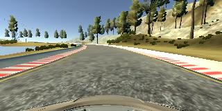
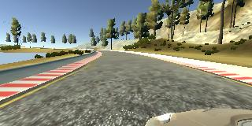
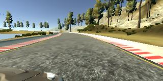
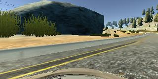
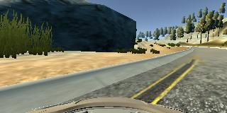
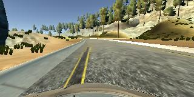
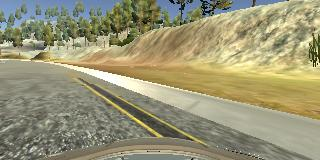
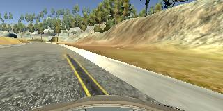
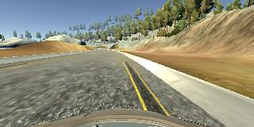

#**Behavioral Cloning** 

##Project write-up
##Student: Jack Olivieri

---

### Rubric Points
####Here I will consider the [rubric points](https://review.udacity.com/#!/rubrics/432/view) individually and describe how I addressed each point in my implementation.

The steps of this project are the following:

* Use the simulator to collect data of good driving behavior
* Build, a convolution neural network in Keras that predicts steering angles from images
* Train and validate the model with a training and validation set
* Test that the model successfully drives around track one without leaving the road
* Summarize the results with a written report


[//]: # (Image References)

[image1]: ./img/augment_normal.png "Center view camera"
[image2]: ./img/augment_mirrored.png "Mirrored dataset image"
  

---
###Files Submitted & Code Quality

My project includes the following files:

* clone.py containing the script to create and train the ultimate architecture used for the submission
* clone.orig.py containing the script to create and train a small convolutaional network
* clone.lenet.py containing the script to create and train a lenet network
* drive.py for driving the car in autonomous mode
* model.easy_track.h5 containing a trained convolutional neural network tuned on the first track
* writeup.md summarizing the results
* easy\_track_video.mp4 showing the performance of the trained network

Using the Udacity provided simulator and my drive.py file, the car can be driven autonomously around the track by executing
 
```
python drive.py model.easy_track.h5
```

The clone.py file contains the code for training and saving the convolutional neural network architecture and weights. The file shows the pipeline I used for training and validating the model, and it contains comments to explain how the code works.


###Training Strategy

####1. Model deployment

My model consists of a convolutional neural network. The model was drafted starting from what the project lecture provided. Step after step, the network was enhanced to extract image features, normalize inputs, crop region of interest and model non-linearity. The repo of this sumbission also includes preliminary experiments with a small convolutional network (see clone.orig.py) and a simple lenet network (see clone.lenet.py).

####2. Over-fitting

The model was trained and validated on different data sets to ensure that the model was not over-fitting. As soon as over-fitting was noticeable (i.e. training loss decreasing whilst validation loss increasing at each epoch), Dropout layers have been deployed inside the network.
This also allowed not to alter the architecture weights dimensions, making fine tuning possible after saving the model weigths and restoring them in a following session (see line 96 and 109 of clone.py).
The model was tested by running it through the simulator (by means of the drive.py script) and ensuring that the vehicle could stay on the track (see easy\_track_video.mp4).

####3. Optimizer and parameter tuning

The optimizer has been chose to be 'Adam', while the metrics for minimizing the loss has been chosen to be 'MSE' (i.e. Mean Square Error). Initially, the learning-rate was automatically set. Since the training has been performed in multiple steps, in order to augment the training set in multiple takes and refine the neural network weights, as soon as a good model architecture was established, the learning-rate has been manually changed to allow a more stable fine tuning (hence line 101 of clone.py). 

###Training data

####1. Import of generated images

Training data was chosen to keep the vehicle driving on the road. I used a combination of center lane driving, recovering from the left and right sides of the road. Since using a keyboard provides inputs that are not as smooth as those of a proper joypad, the challenge was to steer as smoothly as possible to avoid discontinuities in the steering angles.

In order to gauge how well the model was working, I split my image and steering angle data into a training and validation set and watched the respective losses printed out by the keras training session in order to detect over- or under-fitting.

A generator function has been used to batch the training and validation set and yield them to the keras training session. This allows saving memory usage and speeds up execution by running a parallel process for reading the images, while only the batch in use is loaded in memory. I finally randomly shuffled the data set to prevent over-fitting.

####2. Augmentation of training set

While increasing the model complexity soon revealed enhancements during autonomous driving testing, I soon realized that my ability at training increased by getting the hang of using my arrow keys to steer. This prompted me to create the training set with an extensive and good-quality data set.

To capture good driving behavior, I recorded several laps on track one and used only center lane driving images when training. Here is an example image of center lane driving:

![alt text][image1]

To further increase the size of training data, the images have been flipped horizontally (with the steering measurement being negated):

![alt text][image2]

Subsequently, I decided to use all three camera-views have been used (in accordance with a steering correction):

<table class="image">
<caption align="bottom">Multi-camera view - center</caption>
<tr><td></td></tr>
</table>
<table class="image">
<caption align="bottom">Multi-camera view - left</caption>
<tr><td></td></tr>
</table>
<table class="image">
<caption align="bottom">Multi-camera view - right</caption>
<tr><td></td></tr>
</table>


I also recorded the vehicle recovering from the left side and right sides of the road back to center so that the vehicle would learn to compensate and get back on the center of the track in the event of driving off center. These images show what a recovery looks like starting from left- and right-hand side respectively:

#####Left-hand side recovery
<table class="image">
<caption align="bottom">Recovery lap - steering: 0.1</caption>
<tr><td></td></tr>
</table>
<table class="image">
<caption align="bottom">Recovery lap - steering: 0.95</caption>
<tr><td></td></tr>
</table>
<table class="image">
<caption align="bottom">Recovery lap - steering: 0</caption>
<tr><td></td></tr>
</table>

#####Right-hand side recovery
<table class="image">
<caption align="bottom">Recovery lap - steering: -0.35</caption>
<tr><td></td></tr>
</table>
<table class="image">
<caption align="bottom">Recovery lap - steering: -1</caption>
<tr><td></td></tr>
</table>
<table class="image">
<caption align="bottom">Recovery lap - steering: 0</caption>
<tr><td></td></tr>
</table>

For the fun of it, I also trained the model on track two through a separate training set. Because the step was not necessary for the project submission, I have not included the model architecture and weigth files in the github repo/

At the end of the last capture, including all data augmentation, I had 41000 images in my training set for track one. I then preprocessed this data as described in the 'Final Model Architecture' section.


###Final Model Architecture

####1. Design strategy

The overall strategy for deriving a model architecture was to make several attempts with increasingly complex architectures.

My first step was to use a convolution neural network model, similar to the early lecture examples, to get the car to drive a straight line during autonomous testing.
The attempts involved a lenet architecture, which proved being more effective in modeling driving following a slight curvature and minor path corrections.

In a final modeling step, I increased the number of 2D convolution to pick-up on more image features, added more dense layers to model general complexity, added ReLu activation on the convolutional layers to model non-linearity and added Dropout layers to reduce over-fitting.
The model is strongly influenced by the architecture proposed by Nvidia.

At the end of each modification in the model or training set, the simulator was run in autonomous mode to see how well the car was driving around track one. My model proved well-working quite fast and the quality of the training set was high enough to allow the vehicle to drive autonomously around the track without leaving the road, in combination with the final elaboration of the model architecture.

####2. Complete architecture

The final model architecture consists of a convolution neural network with the following layers and layer sizes:

1. 2D Cropping 2D: to isolate region of interest containing interesting road features - 55 px from top, 25 px from bottom
2. 2D Convolution: 5x5 kernel, 24 output levels, 2x2 stride, ReLu activation
3. 2D convolution: 5x5 kernel, 36 output levels, 2x2 stride, ReLu activation
4. 2D Convolution: 5x5 kernel, 48 output levels, 2x2 stride, ReLu activation
5. 2D Convolution: 3x3 kernel, 64 output levels, 1x1 stride, ReLu activation
5. 2D Convolution: 3x3 kernel, 64 output levels, 1x1 stride, ReLu activation
6. Dropout: 60% dropout probability
7. Flatten layer
8. Dense layer: 1164 output length
9. Dense layer: 100 output length
6. Dropout: 70% dropout probability
10. Dense layer: 50 output length
6. Dropout: 50% dropout probability
11. Dense layer: 1 output length (steering angle)

####3. Epochs

To determin the ideal number of epochs, I first used a large number. After finalizing the model, I looked at which epoch the model started to over-fit and used **5 epochs** for the ultimate training session, after which the model architecture and weights were saved and stored on github for the project submission.