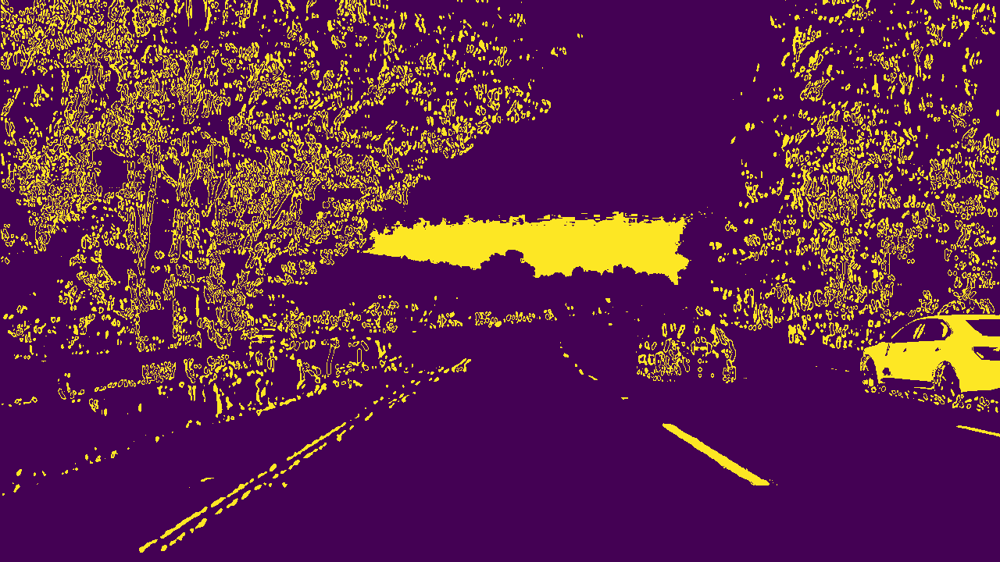
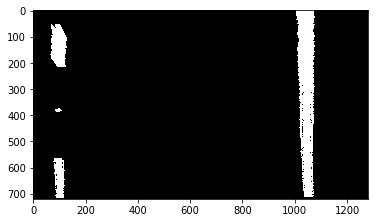
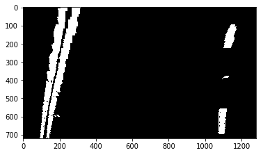
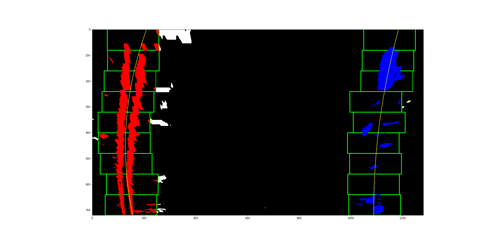
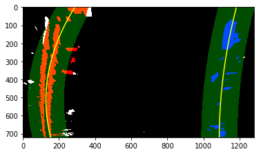
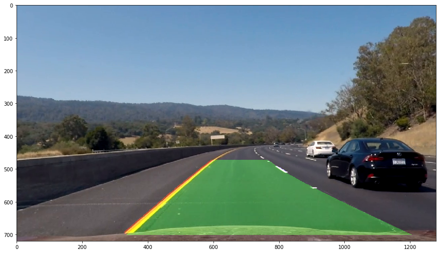

# Advanced Lane Finding - Project Write-up

The goals / steps of this project are the following:

* Compute the camera calibration matrix and distortion coefficients given a set of chessboard images.
* Apply a distortion correction to raw images.
* Use color transforms, gradients, etc., to create a thresholded binary image.
* Apply a perspective transform to rectify binary image ("birds-eye view").
* Detect lane pixels and fit to find the lane boundary.
* Determine the curvature of the lane and vehicle position with respect to center.
* Warp the detected lane boundaries back onto the original image.
* Output visual display of the lane boundaries and numerical estimation of lane curvature and vehicle position.

[//]: # (Image References)

[image1]: ./output_images/calibration2_cornersdrawn.jpg "Corners drawn on chessboard"
[image2]: ./output_images/calibration2_undistort.jpg "Undistorted chessboard image"
[image21]: ./test_images/test1.jpg "Road Transformed"
[image3]: ./examples/binary_combo_example.jpg "Binary Example"
[image4]: ./examples/warped_straight_lines.jpg "Warp Example"
[image5]: ./examples/color_fit_lines.jpg "Fit Visual"
[image6]: ./examples/example_output.jpg "Output"
[video1]: ./project_video.mp4 "Video"

### [Rubric](https://review.udacity.com/#!/rubrics/571/view) Points

#### Here I will consider the rubric points individually and describe how I addressed each point in my implementation.
#### All references to python code refer to the jupyter notebook at this path (w.r.t the github root): <repo-root>/P05-VehicleDetectionTracking/jn.ipynb


## Camera Calibration

In Cell #1, every image depicting the chessboard from a specific angle in the 'camera_cal' directory is read and a for loop iterates through the following steps:

* image gets converted to grayscale
* corners of the chessboard are found by means of the 'cv2.findChessboardCorners' function
* * the number of corner along x and y axis are given to the function in aid of finding the corners
* * corners are expressed in x,y coordinates and are used to form a list of image-space points
* corners are drawn on image by means of 'cv2.drawChessboardCorners' and output into 'output_images' directory (see example in Fig.1)
* corners are also represented in real-world-space by a mesh-grid and form a list of real-world corner coordinates
* * x, y coordinates are pre-determined by number of corner rows and columns
* * z coordinate is assumed to be zero since corners sit on a plane
* The 'cv2.calibrateCamera' function is used to draw distorion coefficients and camera matrix by using list of corners in image- and real-world-space.

<table class="image">
<caption align="bottom">Fig.1: Corners drawn on chessboard</caption>
<tr><td></td></tr>
</table>


## Pipeline

#### 1. Applying distorsion correction

As per the code in Cell #2, every image in the 'camera_cal' directory is read in a for loop and an undistorted copy is generated by means of the 'cv2.undistort' function, which in turn uses the previously calculated distortion coefficients and camera matrix. See an example in Fig.2 showing the undistorted version of image in Fig.1.

<table class="image">
<caption align="bottom">Fig.2: Undistorted chessboard image</caption>
<tr><td></td></tr>
</table>

### 2. Creating a thresholded binary image.

In Cell #3 a list of image processing functions are specified, each defining the building blocks of the image processing pipeline. Here follows a description of each:

* sobel_x, sobel_y: sobel filtering function along x and y axis respectively, with kernel size as input parameter
* scale_thresh_image: the function scales the image values and then creates binary image filtering values above parameter-defined threshold
* sobel_thresh: uses sobel_x or sobel_y and applies scaling and thresholding by means of 'scale_thresh_image'. All above parameters are used with the addition of an orientation parameter
* mag_thresh: returns a binary image by scaling and thresholding the magnitude of the sobel components calculated along x and y axes. All above parameters (except orientation) are used.
* dir_thresh: returns a binary thresholded image based on the arctan function of the sobel components calculated along x and y axes, in order to filter out sobel gradients of a specific angle range (passed as input parameter). Kernel size can be passed as a parameter.
* thresholding_pipeline: this function represents the main processing pipeline function. It consists of several processing steps which are then combined to obtain an optimal binary image used for the lane detection. The processing steps are:
* * conversion to HSL colorspace
* * conversion to grayscale
* * thresholding of grayscale image
* * thresholding of sobel along x axis of S color component
* * the thresholded values for both sobel_x(S) and (grayscale) are combined (joining with an OR operation the 'ones' of each image)

N.B.: tuning of the input parameters for each pipeline processing step has been carefully tuned by evaluating each pipeline stage as well as the entire processing pipeline on some of the images in the 'test_images' directory. See example in Fig. 5. Also, to experiment with various thresholded images combinations at later stages in the project, a *Debug* flag in the main pipeline function has been used to extrapolate the aforementioned thresholded images and return a dictionary containing such a multitude of binary images.

Here follows an example of the application of the processing pipeline on one of the example image produced after distortion correction (see Fig. 5 and 6)

<table class="image">
<caption align="bottom">Fig.5: Example road image</caption>
<tr><td></td></tr>
</table>

<table class="image">
<caption align="bottom">Fig.6: binary processing pipeline applied on road example image</caption>
<tr><td></td></tr>
</table>


### 3. Applying perspective transform

In notebook Cell #5 two array of point coordinates are defined, whereby the former denotes four specific points in the image-space (src_points) and the latter defines the point coordinates as per a bird's eye view perspective (dst_points) that each corresponds to the coordinates of the former array. The points are chosen so as to define a trapezoid region of interest in the image enclosing the lane where the car is currently driving on, in an effort to clean the region of interest from noisy surrounding areas.
A function called 'cv2.getPerspectiveTransform' is used to derive the transform and inverse transform matrix that will be used to transform an image region of perspective view into a warped image where, in this case, the perspective view is 'stretched' over a bird's eye view. In order to achieve the latter transformation, the 'cv2.warpPerspective' function is used. In order to 'de-warp' the image, as seen later in the project, the same function is used with the inverse transform matrix passed as parameter.

The points in src_points were manually chosen on several of the test images and those in dst_points were chosen so as to cover the full 1280-by-720 image frame (corresponding to the full frame size). Some minor modification in the dst_points point coordinates was made to obtain perfectly straight lines upon warping the test images depicting straight lines.

```python
src_points = np.float32(
    [[547,  472],
     [764,  472],
     [1280, 702],
     [290,  702]])

dst_points = np.float32(
    [[0,     0],
     [1280,  0],
     [1280, 720],
     [155.5,720]])
```

After applying warping, a result such as depicted in Fig. 7 (straight lines) and 8 (curving lines) is obtained:

<table class="image">
<caption align="bottom">Fig. 7: binary warped image obtained from straight lane lines</caption>
<tr><td></td></tr>
</table>

<table class="image">
<caption align="bottom">Fig. 8: binary warped image obtained from curved lane lines</caption>
<tr><td></td></tr>
</table>


### 4. Detecting lane boundaries

In notebook cell #6 a 'find_lanes_full_search' and a 'find_lane_quick_search' functions were defined. The former fully searches a binary warped image whereas the latter searches regions of the binary warped image based constrained by a margin distance from a previously detected lane line.

1. *Full search*:
 * * a histogram along the y-axis for non-zero values is drawn so as to find the centroids of each lane lines. This is easily done by calculating the x-axis coordinate corresponding to the argmax(_histogram-values_) for both the left- and right-half of the frame, assuming each lane non-zero pixels will mostly be present in one half of the frame.
 * * an iteration through a series of windows which divide the y-axis in several steps is performed. For each iteration a range of x-axis values are checked for non-zero values, where the x-axis value range is defined by a margin within the centroids.
 * * at the end of the iteration, before stepping into the following window step along the y-axis, the centroid of each lane is updated based on the newly found non-zero values (namely, the mean x coordinate of such non-zero values).
 * * as shown in cell #7 (and later in cell #14 in the 'sanity_check' function used in assessing the validity of the lane lines for each frame of the video), the non-zero values found by the full search function are used by the 'np.polyfit' function to determine the coefficients of a second order polynomial line that best fits the lane line pixels (that is, the non-zero values).
 
2. *Quick seach*:
 * * the polynomial coefficients found in the fitting step following a full-search (or quick-search) are used to check within a region of the binary image for the non-zeros values (again, the non-zero values ideally denote the presence of a lane line).
 * * such a region covers pixels that come off the previously fitter line by, at most, a defined margin.
 * * the newly found non-zero values are used in the current iteration to redefine the polynomial coefficients for used for determining an updated line fit.
 
In the example in Fig. 9, one of the binary warped images has been been fully searched for lane lines. The search windows based around the histogram centroids are highlighted in green, while the second order polynomial line is highlighted in yellow. Additionally, each non-zero valued pixel that was detected as part of either lane line was colored red or blue depending on which lane line they belong to.

In the example in Fig. 10, the same binary warped image is used to highlight the region of interest the quick-search method would utilize in the next frame iteration. The region was drawn by means of the 'cv2.fillPoly' function.

<table class="image">
<caption align="bottom">Fig. 9: lane lines fitted to a binary warped image</caption>
<tr><td></td></tr>
</table>

<table class="image">
<caption align="bottom">Fig. 10: region of interest for quick-searching a fitted binary warped image</caption>
<tr><td></td></tr>
</table>


### 5. Detecting curvature and vehicle position

As shown in notebook cell #9, the curvature and the lane position (expressed in terms of x coordinate) are easily derived from the by means of the 'get_curvature' and 'get_lane_x_coord' functions.

1. *get_curvature*: evaluates a polynomial curve, characterized by the search-derived coefficients, at the bottom of the frame (x-axis=720, the reference position of the car).
2. *get_lane_x_coord*: will be used to derive the position of each lane line at the bottom of the frame (x-axis=720, the reference position of the car). The two coordinates can be used to derive the center position of the lane with respect to the center position along the x-axis of the image.

After deriving the curvature and lane position for a given frame, the figures are still expressed in pixel coordinates. In order for them to be expressed in meters, a rough estimate for a conversion rate has been derived based on the assumption that a warped image is 30 meters long corresponding to 720 pixels along the y-axis and about 3.7 meters corresponding to 1080 pixels (distance in pixels measured on average between the lane line x coordinates at the bottom of the frame) along the x-axis.

Here are some curvature values found on some of the test warped binary images (some images were very noisy so values will be more realistic once they get low-pass filtered over a series of frames):

* test image 3 curvature:
  left 3725 px, right 2957 px
  left 1855 m, right 1498 m
* test image 4 curvature:
  left 7582 px, right 5432 px
  left 3817 m, right 2720 m
  

### 6. Defining a function for performing sanity checks on lane lines

As expected from such color-space-sensitive and non-trivial image processing techniques, some frames will result in very noisy binary images which may result in absurd lane line fitted curves and curvature values. In order to filter out invalid frames a function called 'sanity_check' has been implemented and is shown in cell #12. The sanity checks are performed in conjuction with a lane line 'history', which is implemented as a 'Line' objects (python class implementation is used) that store some key characteristics of the lane line across the last *lane_history_size* frames. The buffers of such characteristics are implemented as doubly-ended queues.
The main checks that are performed by the 'sanity_check' function are:

* the number of non-zero lane point coordinates found by a full-search of quick-search must be at least a certain amount for each line to be considered valid
* if either line is valid, second order polynomials are fitted and lane line x coordinates are derived, which in turn are used to calculate the lane width at top and bottom of the image
* new curvature values are derived for valid lines, otherwise averaged curvature values from previous frames are used for invalid lines
* Two conditions are checked:
* * by defining a tolerance, the ratio between the top lane width and the bottom lane width is used to evaluate if the lane lines are adequately parallel
* * by defining a tolerance, the difference between the two curvature values is evaluated relative to their mean value is evaluated
* if lane lines are not enough parallel, the function will check if either the left- or the right-lane has top and bottom end-points consistent with the history of such coordinates of their respective lane line. If not, the lane line is discarded. This steps function as an extra step to make sure the lane line is really not valid and completely off the recent average line position
* if the curvature values are found to be unacceptable against the tolerance, each line curvature is checked against its history and, if not sufficiently consistent, the line is discarded
* the history of each lane line (passed as a global 'static' variable) are updated accordingly

*Note to the reviewer: I admit that the algorithm illustrated above may look like over-engineering, I do assure the reviewer, though, that I put the most effort into making sure that no noisy and ridiculously false lane detection would tamper the results on a video. I designed such function while testing it extensively on the main and hard project videos, obtaining very successful results which were easy to appreciate thanks to all the debug information that I made available.*


### 7. De-warping of lane images

A function named 'find_lanes' (cell #13) was used to put together the image processing and binary image creation stage ('thresholding_pipeline'), lane marking detection ('find_lanes_full_search'/'find_lane_quick_search' + 'sanity_check'), lane polynomial fit ('sanity_check') and finally coloring of lane region ('cv2.fillPoly') and inverse warping on top of original frame ('cv2.warpPerspective' + 'cv2.addWeighted').
Noteworthy of mentioning are details such as the 'Debug' code that allows the developer to try out several combination of binary images, the use of a quick search if for not more than 2 frames either of the lane lines is not detected (which speeds up processing).

Fig.11 depicts and example of using such function on a video frame.

<table class="image">
<caption align="bottom">Fig. 11: example of inverse warping the lane region and overimposing the result on a frame from the project video</caption>
<tr><td></td></tr>
</table>


### 8. Pipeline performance on recorded video

The video in *./project_video_out.mp4* is the result of using the processing pipeline on each individual frame of the video in *./project_video.mp4*. See cell #14 for the implementation details. Please, also note the 'Debug' mode which allows to test the processing pipeline on individual frames of the video, which turned out very useful when testing on critical frames. Enjoy!


---

### Discussion

#### Issues and potential improvements

* One of the most prominent issues in the beginning was getting a combination of binary thresholded images that would filter out lane marking not only for specific colors, but also for low image quality and highly noisy images that would compromise the detection. Just as an idea for improving the performance of the binary image processing stage, I thought about implementing an adaptive algorithm that allows computing different combinations of binary images depending on the quality of the frame lane detection ('sanity_check' already implements many techniques for assessing the validity of the detection), so as to always choose the combination that works best for the specific image conditions.
* Another issue may arise is that the second order polynomial fit may not be suitable for very complex lane shapes such as those seen in the very hard project video.
* All videos don't cover the use case where a car is traveling closely to the our car where the camera is mounted: in this case, if our car gets to close to the one in front, the lane lines may not be detectable for a multitude of consecutive frames. One interesting approach would be to use some algorithm for car detection (one is for instance covered in Project 6), so as to modify the region of interest of the frame that is subject to warping, allowing the system to know that the lane detection has to be performed in critical conditions.
* Things that worked for me:
* * I spent significant effort in filtering out invalid lane lines ('sanity_check') based on sensible criteria such as lines that are parallel and consistent curvature. After a lot of tolerance parameter tuning, the results were very satisfying.
* * Leveraging the saturation channel in the binary image creation turned out very effective for detecting the yellow line, wherease the grayscale thresholding highlighted the white line.

