# Vehicle Detection and Tracking

---
The goals / steps of this project are the following:

* Perform a Histogram of Oriented Gradients (HOG) feature extraction on a labeled training set of images and train a classifier Linear SVM classifier
* Optionally, you can also apply a color transform and append binned color features, as well as histograms of color, to your HOG feature vector. 
* Note: for those first two steps don't forget to normalize your features and randomize a selection for training and testing.
* Implement a sliding-window technique and use your trained classifier to search for vehicles in images.
* Run your pipeline on a video stream (start with the test_video.mp4 and later implement on full project_video.mp4) and create a heat map of recurring detections frame by frame to reject outliers and follow detected vehicles.
* Estimate a bounding box for vehicles detected.

### [Rubric](https://review.udacity.com/#!/rubrics/513/view) Points. Here I will consider the rubric points individually and describe how I addressed each point in my implementation.  
---

### Car and non-car picture importation

Image file names were loaded (Cell #1) from a lists of png/jpeg files from the following:

* 'vehicle' directory
* 'non-vehicle' directory
* 'object-detection-crowdai/labels.csv' comma separated list

In the last case, bounding boxes are also loaded to crop images from the jpeg files, although only a 64-by-64 window (by either resizing or cropping, this is done in Cell #4) is used to make it consistent with the image format provided by the vehicle/non-vehicle data set. The data set is later split into training set and validation set.
In Fig.1, 2 and 3 there are excerpts of vehicle, non vehicle and crowdai data sets respectively.

    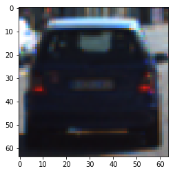
    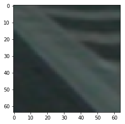
    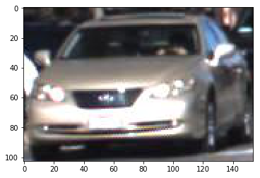
    <caption align="bottom">Fig.1: Excerpts of vehicle (left), non-vehicle (center) and crowdai (right) datasets</caption>

### Image data processing pipeline

#### 1. Functions

The code that defines all building blocks of the image processing pipeline is shown in Cell #3:

* 'convert_color': this function will convert an RGB image (images are read with *matplotlib.image.imread()*) to the one of the following color-spaces:
* * YCrCb, LUV, HLS, HSV, YUV
* 'get_hog_features': this function represents the core of the processing since the feature extraction is largely based on getting HOG features of an image. Input parameters are: a single-channel image, orientation, pixels-per-cell, cells-per-block and flags for enabling outputting a HOG image and/or a feature vector (the latter being of most interest).
* 'bin_spatial': this function extracts a concatenation of each color components of an image, resizing it to a specific input size and 'ravels' the pixel into a one-dimention array, very suitable for feature extraction.
* 'color_hist': returned a concatenation of histogram vectors (returned by *np.histogram()*) based on each of the 3 color compoments of an image.

I then explored different color spaces and different `skimage.hog()` parameters (`orientations`, `pixels_per_cell`, and `cells_per_block`).  I grabbed random images from each of the two classes and displayed them to get a feel for what the `skimage.hog()` output looks like.

Fig. 2 depicts two example images (car and not-car respectively) converted to the 'HSV' color-space. Many color spaces were explored, especially when aiming at increasing the classifier performance and the general performance in the final project video.

    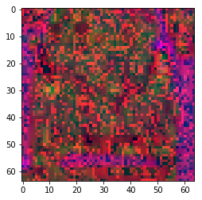
    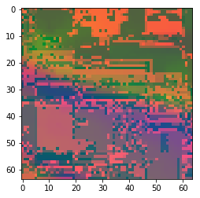
    <caption align="bottom">Fig.2: Example of a car (left) and non-car (right) image in HSV space</caption>

Another interesting analysis is depicted by Fig. 3, where an image returned by the *skimage.feature.hog()* function is displayed. The HOG image highlights the 'HOG features' extracted from one of the car images, essential to the training of the car image classifier.

    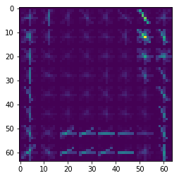
    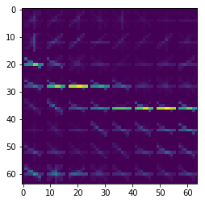
    <caption align="bottom">Fig.3: HOG analysis of a car (left) and non-car (right) image in HSV space</caption>

#### 2. Feature extraction

The 'extract_features' function in Cell #4. Noteworthy is the scaling (and conversion to float) of each image depending on their value range and flags that enable the presence of 'bin spatial', 'color histogram' and/or 'HOG' components. In Cell #6 the feature vectors that will be fed to the scaler and classifier are created. For performance purposes, the crowdAI dataset was not used, since a high validation accuracy was yielded anyway while significantly saving on compute time.

### Training

#### 1. Choice of feature extraction parameters

At first choosing the hog parameters, along with color histogram bin number and resizing, was relying on trial and error, with a certain degree of common sense (for instance choosing a multiple of 4 for number of orientation since a car shape is probably characterized by rectangular shapes). As I refined the parameters for pixels per cell, cells per block and window size, I iteratively ran the classifier to get a feel for what parameter set was delivering the best classification performance. The final parameters are shown in Cell #5.

Tuning parameters:

* color space = 'LUV'
* \# HOG orientations = 8
* \# HOG pixels per cell = 8
* \# HOG cells per block = 2
* \# HOG channel = "ALL"
* Spatial binning dimensions = (32, 32)
* \# Number of histogram bins = 32
* feature extraction flags:
* * extract_spatial_features = True
* * extract_hist_bins_features = True
* * extract_hog_features = True

#### 2. Classifier training

In Cell #8, the classifier training is performed in these steps:

* the feature vectors are fed into a scaler (*sklearn.preprocessing.StandardScaler()*) in order to normalize the classifier features, removing the mean and scaling to unit variance, and ensure that the classifier works properly.
* user-defined flags are used to choose a SVC classifier that allows to reach a certain validation accuracy while not compromising the performance in terms of speed. Several classifiers were tested:
* * radial basis function
* * polynomial
* * the latter two were also tested by model selection technique (*sklearn.model_selection.GridSearchCV()*) in combination with certain *gamma* and *C* parameters
* * Linear SVC
* the training execution time is calculated and printed
* the training accuracy is evaluated on the validation set

Ultimately an SVC classifier was chosen since it achieved, in combination with careful tuning of image processing parameters, a validation accuracy over 99% while maintaining reasonably short execution time.

### Sliding Window Search

Cell #9 shows the code for the window search function that will be used to search each video frame and feed the classifier with multiple windows. The idea behind this search is to iterate over a multitude of frame windows of the same size of the images used for extracting features, in an effort to capture as many (fractions of) cars as possible that will result in the classification and identification of cars. In order to do that, a window is slid in a region of interest of the frame, with overlapping blocks of pixels, maximizing the likelihood of running into enough car pixels. The main steps of the search are:

* isolating the region of interest in the image
* scaling the image so as to obtain cars at the framed distance proportional to the size of those seen in the training set
* defining
* * the number of steps or 'slides'
* * the window position withing the frame portion at each iteration
* * the window size (passed as parameter)
* * the number of pixels (or HOG cells) to step (or 'slide') at each iteration
* all other parameters are passed and must be those chose for training the classifier  
* the search function recreates the feature vector with hog, spatial binning, and color histogram binning each enabled by their respective flags
* the feature vector is run through the classifier and upon recognizing a car, a bounding box with vertices corresponding to the current window is returned
* for debugging purposes, the bounding boxes (corresponding to the windows that tested positive at the classifier) are drawn on top of the input image (see Fig. 4)

Tuning the cell overlapping parameter was relatively easy, since the starting value of 2 HOG cells is good enough to capture good car images at each search iteration. The number of HOG cells would become critical only if the number of pixels per HOG cell is very high, which was never the case. By running the search function on the test images and looking at the size of the resulting drawn boxes, I could get a feel for how much I should scale each  vertical slice of the region of interest, also taking into account several frames where the cars were depicted at various distances. The frame was ultimately sliced in two regions, the first depicting farther cars and the second depicting nearer cars, being scaled by 1.4 and 2 respectively, as shown in Cell #11. The scaling factors are used in combination with the image processing parameters and the scaler used during training to achieve a complete region of interest search as shown in Cell #10 in the 'search_roi' function.

After tuning all above discussed parameters, the results were pretty satisfying, as shown in Fig. 4, 5 and 6. Some false positive are though still present and need to be later filtered-out.

    
    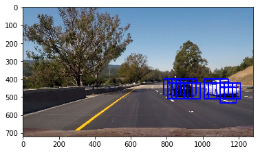
    <caption align="bottom">Fig.5: An example of running the window-based search for cars, input image (left), detection windows (right). Note the window size being proportional to the y-axis (therefore distance) of the car.</caption>

    
    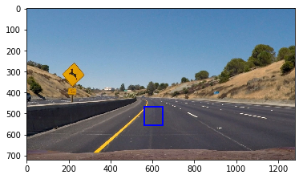
    <caption align="bottom">Fig.6: An example of running the window-based search for cars, input image (left), detection windows (right). Note the false positive in correspondance to the pavement.</caption>

---

### Video Implementation

#### 1. False positive filtering

One effective technique that allows to find the most probable location of a car within a frame consists in the computation of a 'heatmap' by summing the contribution of each car-detection window within one frame. Regions with a multitude of overlapping windows are much more likely to be found in correspondance of a car than a false positive. By filtering out pixels with sufficiently high values of overlapping windows, one can successfully filter out false positive. The value chosen in this project was 2, as shown in Cell #14.

The code to implement the heatmap, image region labeling (based on the *scipy.ndimage.measurements.label()* function) and drawing of bounding boxes based on extreme coordinates of labeled regions is implemented in Cell #13 and #14 and is mostly based on the code introduced in the lessons, as the latter proved very effective from the beginning.

The following figures illustrate the latest stages of the vehicle detection pipeline, which is executed in its entirety in Cell #14.

<table class="image">
<caption align="bottom">Fig.7: One of the example images</caption>
<tr><td>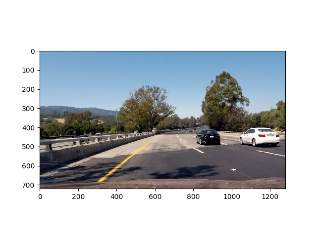</td></tr>
</table>

    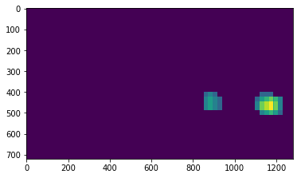
    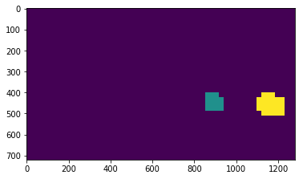
    <caption align="bottom">Fig.8: the thresholded heatmap corresponding to the above image (left), and the labeled region resulting from the thresholded heatmap (right).</caption>

<table class="image">
<caption align="bottom">Fig.8: the superimposition of the resulting bounding boxes over the example image</caption>
<tr><td>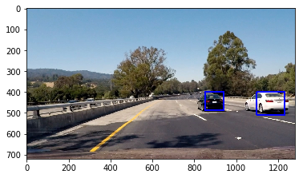</td></tr>
</table>

The only extension to the algorithm consists of keeping a doubly-ended queue of list of boxes that buffers 10 frames worth of bounding boxes. On this queue of bounding boxes lists, another heatmap is created based on the bounding boxes that most contribute to a certain region. The rational behind this technique is that if a car is correctly detected, for a certain number of frames it will keep occupying, at least partially, a certain region of the frame. Finally the new frame-cross heatmap is thresholded again to discard more false positives. To appreciate the effectiveness of this technique, please have a look at the final project video output.

The resulting video is stored in this file: ./project_video_out.mp4

---

### Discussion

The vehicle detection techniques proved successful in detecting vehicle and keeping track of them. A critical part of the detection pipeline is though the classification which often times results in false positives. One technique that would definitely increase the performance is that of using 'hard negative mining', which allows to re-train the neural network with samples taken immediately from a test set. In our case, this would correspond to feeding labeled data to our classifier, where the data classes fall under either car or non-car. For instance, since one would want to get rid of false positive, training the neural network by feeding it a multitue of images from other sources (for instance, the project video itselg) where a lot of windows marked as 'notcar' woudld contribute to a higher accuracy in classifying non-car images as such.
